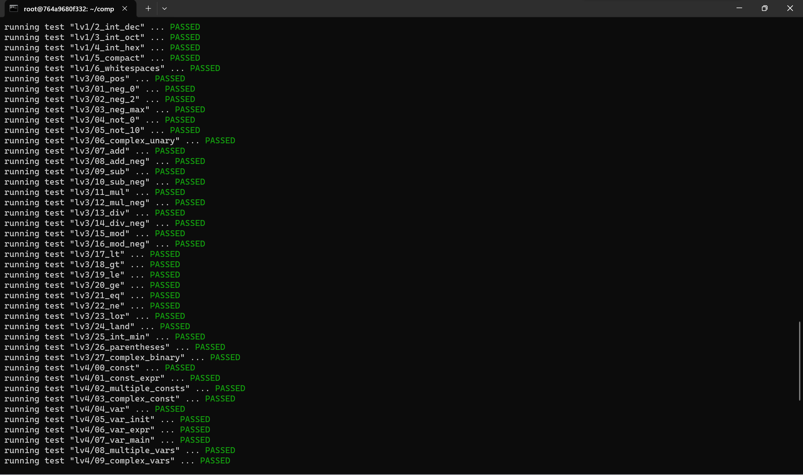
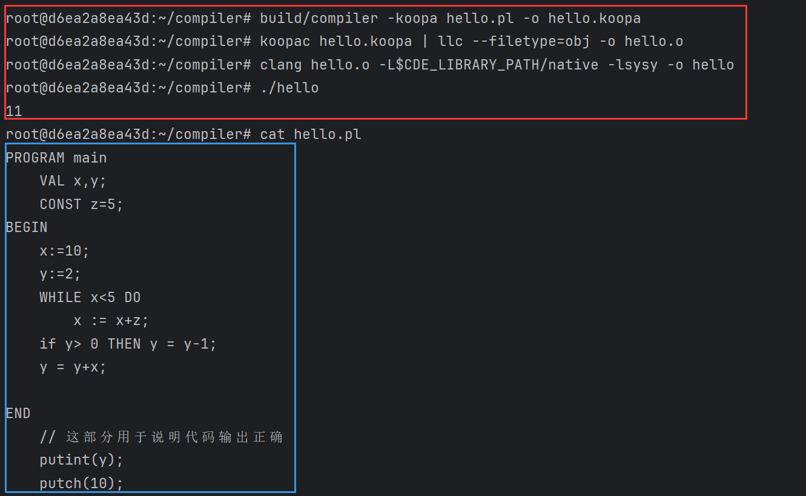

# 基于北大编译原理实验的sysy编译器实现

## 项目说明

本项目为基于[北大编译实践在线文档](https://pku-minic.github.io/online-doc/#/),完成了pl/0到RISCV汇编语言的编译。该编译器可以实现如下两个功能

* 将pl/0语言编译为RISCV汇编语言

* 将C语言编译为RISCV汇编语言

开发使用工具如下：

* 词法分析：flex。flex的相关实现与规则定义在sysy.l中
* 语法分析：bison。bison的相关实现与规则定义在sysy.y中
* 中间代码：基于北大编译实践开发的koopa库。相关代码的实现与规则定义在*Ast.\*中。
* 目标代码：RISCV汇编。相关代码的实现与规则定义在createRiscV.cpp/hpp中。

对于pl/0语言，项目可编译结构如下：

* 可以识别 PROGRAM，BEGIN，END，CONST，VAR，WHILE，DO，IF等关键字
* 可以识别':='等各种计算符
* 可以编译while，if等控制结构
* 可以编译文件中给出的示例源程序

对于C语言，项目可编译结构如下：

* 完成一般表达式编译。编译器可以处理如1+2=3等基本计算式
* 完成常量，变量编译。完成对常量的编译预处理。编译器可以处理int a =123,b=245等赋值语句
* 完成语句块和作用域编译。编译器可以实现变量名低层屏蔽高层的特性
* 完成分支语句。编译器支持if块与ifelse块语句编译
* 完成循环语句。编译器支持while，break和continue的循环控制
* 完成函数与全局变量。编译器支持定义全局常变量，调用sysy库函数与自定义函数的编译。

对于C语言编译为RISCV语言，项目通过了北大编译实践原理的本地评测lab1-lab7。具体输出在testresult.txt.

[这里](https://github.com/PublicCo/23-se-compiler)是我的实现的GitHub仓库。可以在git log中查看完整的开发记录

## 代码编译/使用

本项目开发过程中，项目编译环境是基于[北大编译实践在线文档](https://pku-minic.github.io/online-doc/#/)提供的docker环境。你可以查看[这里](https://pku-minic.github.io/online-doc/#/lv0-env-config/)进行环境配置。当然，你也可以根据makefile内容进行本地环境配置。（通常来说，一台安装了flex和bison，可以正常编译c++程序的环境就可以编译运行，但是如果你希望能够尝试运行中间生成的koopa文件，必须采用该文档提供的docker环境）。

本项目提供可执行程序。你可以在Linux环境下运行build/compiler。编译格式如下

~~~bash
build/compiler -riscv your_program_filename  -o your_output
~~~

你也可以查看代码的中间代码生成。编译格式如下：

~~~bash
build/compiler -koopa your_program_filename  -o your_output
~~~

项目根据期末作业文档提供了一个示例输出，可以试试

~~~bash
build/compiler -riscv hello.pl -o hello.out 
~~~

根据北大编译原理使用的[koopa库规范](https://pku-minic.github.io/online-doc/#/lv0-env-config/koopa) ,你可以通过以下bash命令编译运行生成的koopa文件。假设你编译后的文件名为hello.koopa，并且你当前的环境是上文中提到的docker镜像：

~~~
build/compiler -koopa your_filename -o hello.koopa
koopac hello.koopa | llc --filetype=obj -o hello.o
clang hello.o -L$CDE_LIBRARY_PATH/native -lsysy -o hello
./hello
~~~

示例结果如下。蓝色框内为要编译的源代码，红色内为编译后输出的结果。其中putint(y)的意思是输出y的值，putch(10)的意思是输出ASCII码为10的字符（也就是回车）。根据示例程序的逻辑与输出结果可以看出编译后生成的中间koopa文件最终编译运行结果是正确的。

## 代码说明

### flex部分

flex使用正则的方法匹配关键字。首先用三部分正则匹配去掉注释与空格：

~~~flex
/* 空白符和注释 */
WhiteSpace    [ \t\n\r]*
LineComment   "//".*
BlockComment  "/*"(?:[^\*]|\*+[^\/\*])*\*+\/
~~~

然后匹配一部分指定的关键字

~~~flex
{WhiteSpace}    { /* 忽略, 不做任何操作 */ }
{LineComment}   { /* 忽略, 不做任何操作 */ }
{BlockComment}  { /* 忽略, 不做任何操作 */ }
"PROGRAM"       { return Program;}
"BEGIN"         { return Begin;}

"END"           { return End;}
"DO"            { return Do;}
"VAL"           { return INT; }
"int"           { return INT; }
"THEN"          { return Then;}
"return"        { return RETURN; }
"CONST"         { return Const; }
"const"         { return Const; }
"if"            { return If;}
"else"          { return ELSE;}

"while"         { return While; }
"WHILE"         { return While; }
"break"         { return BREAK; }
"continue"      { return CONTINUE; }
"void"          { return VOID; }
~~~

同时需要匹配一些双字符的符号表达式。

~~~flex
":="            { return SETVAL;}
"||"            { return LOR; }
"&&"            { return LAND; }
"=="            { return EQ; }
"<>"            { return NEQ; }
"!="            { return NEQ; }
">="            { return GEQ; }
"<="            { return LEQ; }
~~~

最后匹配单个字符或者一些变量名，数字等

~~~flex
{Identifier}    { yylval.str_val = new string(yytext); return IDENT; }

{Decimal}       { yylval.int_val = strtol(yytext, nullptr, 0); return INT_CONST; }
{Octal}         { yylval.int_val = strtol(yytext, nullptr, 0); return INT_CONST; }
{Hexadecimal}   { yylval.int_val = strtol(yytext, nullptr, 0); return INT_CONST; }
.               { return yytext[0]; }
~~~

### bison部分

项目使用自顶向下的递归分析方法进行语法分析。

* 对于pl/0部分，本项目遵守课程设计文件中要求的ENBF规范。

* 对于C部分，你可以在[这里](https://pku-minic.github.io/online-doc/#/lv8-func-n-global/)看到本项目遵守的ENBF规范。

当然，由于受限于bison规则要求以及项目代码设计，部分特性实现不能完全照抄ENBF。几个典型设计说明如下：

* 单语句多变量赋值：

> 根据实验手册，建议的是使用vector的方法记录变量与赋值。但是由于bison使用限制，容易出现重复内存申请与重复内存析构的问题。因此采取链表的方式设计语法树节点。具体来说，是将变量语法树结点构成一个链表，然后将链表头链接到夫节点上

​	一个具体的实现如下

~~~bison
ConstDefList
    :ConstDef{
        $$ = $1;
    }
    | ConstDefList ',' ConstDef{
        $$ = $1;
        auto cd = point<ConstDefAST>($3);
        $$->AddItem(cd);
    }
    ;
~~~

* ifelse空悬问题

> ifelse空悬会导致ifelse嵌套的解析出现二义性。解决办法是将非终结符分为后面一定不会跟else和可能会跟else两部分。这样就避免了二义性。
>
> while循环也是这么解决的。

一个具体的实现如下：

~~~bison
FinalStmt
    : RETURN Exp ';' {
        auto exp = std::unique_ptr<BaseAST>($2);
        $$ = new StmtAST(exp);
    }
    | LEVal '=' Exp ';'{
        auto lval = std::unique_ptr<BaseAST>($1);
        auto exp = std::unique_ptr<BaseAST>($3);
        $$ = new StmtAST(exp,lval);
    }
    | Block{
        auto stmt = new StmtAST();
        stmt->type = StmtType::BlockStmt;
        stmt->num = std::unique_ptr<BaseAST>($1);
        $$ = stmt;
    }
    | Exp ';'{
        auto stmt = new StmtAST();
        stmt->type = StmtType::OneExp;
        stmt->num = std::unique_ptr<BaseAST>($1);
        $$ = stmt;
    }
    | ';'{
        auto stmt = new StmtAST();
        stmt->type = StmtType::NoExp;
        $$ = stmt;
    }
    | IF '(' Exp ')' FinalStmt ELSE FinalStmt{
        auto ast = new IfElseAST();
        ast->sequence = point<BaseAST>($3);
        ast->ifexp = point<BaseAST>($5);
        ast->elseexp = point<BaseAST>($7);
        $$ = ast;
    }
    | WHILE '(' Exp ')' FinalStmt{
        auto ast = new WhileAST();
        ast->condition = point<BaseAST>($3);
        ast->stmt = point<BaseAST>($5);
        $$ = ast;
    }
    | ConBre{
        $$ = $1;
    }
    ;
NotFinalStmt
    : IF '(' Exp ')' Stmt{
        auto ast = new IfElseAST();
        ast->sequence = point<BaseAST>($3);
        ast->ifexp = point<BaseAST>($5);
        $$ = ast;
    }
    | IF '(' Exp ')' FinalStmt ELSE NotFinalStmt{
        auto ast = new IfElseAST();
        ast->sequence = point<BaseAST>($3);
        ast->ifexp = point<BaseAST>($5);
        ast->elseexp = point<BaseAST>($7);
        $$ = ast;
    }
    | WHILE '(' Exp ')' NotFinalStmt{
        auto ast = new WhileAST();
        ast->condition = point<BaseAST>($3);
        ast->stmt = point<BaseAST>($5);
        $$ = ast;
    }
    ;
~~~

### 中间代码生成部分（koopa部分）

* BaseAST

  BaseAST作为虚基类，是其他AST节点的模板类。在BaseAST中实现了五个方法：

  ~~~C++
  class BaseAST {
  public:
      virtual ~BaseAST() = default;
  
      virtual std::string DumpAST() const {
          return "Not Implement";
      };
  
      virtual std::string DumpKoopa() const {
          return "Not Implement";
      };
      virtual int Calc() const {
          cerr<<"Not Implied Calc,unexcept situation may be occur"<<endl;
          return 0;
      }
      virtual string ExtraOutput() const{
          cerr<<"this function should not be called in default,please check if you have overriden the function"<<endl;
          assert(0);
      }
      virtual vector<int>CommunicateIntVector() const{
          cerr<<"this function should not be used unless it is overriden"<<endl;
          assert(0);
      }
  };
  ~~~

  其中前三个分别是AST节点调试，koopa中间代码生成和编译期常量用。后两个用于函数之间的通信。通过复用trait，可以让实现的节点保持一定规范

* 智能指针

  bison的生成过程中会有各种内存申请。为了避免内存管理时出现多次释放与内存泄露，采用unique_ptr对每个语法树节点进行管理。智能指针类似于rust中的所有权分配，通过将内存分配给唯一一个指针，确保每次申请与析构都不会出现内存泄露

* 一元运算符计算：

  根据koopa规范，koopa并不支持二元运算符运算。因此需要使用一些操作来处理+，-，！

  * +：不需要处理，+6和6是等价的
  * -：用sub来处理，-6和表达式0-6是等价的
  * ！：用比较运算来处理。!a与a == 0 是等价的

* 优先级

  对于运算符优先级，其实已经在BCNF中规定好了，只要遵守BCNF的设计进行实现即可

  ~~~
  Exp         ::= LOrExp;
  PrimaryExp  ::= "(" Exp ")" | Number;
  Number      ::= INT_CONST;
  UnaryExp    ::= PrimaryExp | UnaryOp UnaryExp;
  UnaryOp     ::= "+" | "-" | "!";
  MulExp      ::= UnaryExp | MulExp ("*" | "/" | "%") UnaryExp;
  AddExp      ::= MulExp | AddExp ("+" | "-") MulExp;
  RelExp      ::= AddExp | RelExp ("<" | ">" | "<=" | ">=") AddExp;
  EqExp       ::= RelExp | EqExp ("==" | "!=") RelExp;
  LAndExp     ::= EqExp | LAndExp "&&" EqExp;
  LOrExp      ::= LAndExp | LOrExp "||" LAndExp;
  ~~~

* 逻辑表达式

  由于Koopa并不支持逻辑与或，生成的代码需要通过比较式进行拼接。例如：a&&b的实现方式为:

  (a eq 0)+(b eq 0) eq 0.  其中a eq b返回一个01真值，若a等于b返回1否则返回0

* 变量表

  变量表是使用一个unordered_map的vector实现的。每一个block使用一个unordered_map，搜索变量时从最后进vector的map向前搜。这样就实现了底层屏蔽高层的特性。

  在处理变量的时候，有四种变量需要处理。因此实现了一个enum class ValType用于记录变量表中存储的变量名类型

  ~~~C++
  enum class ValType{
      Const,
      Var,
      IntFuncname,
      VoidFuncname
  };
  
  struct symboltype{
      int num;
      ValType type;
  };
  ~~~

  

同时为了重名，在将c转成koopa时，采用了COMPILER_变量名\_位于第几层block\_使用第几次的中间代码命名方式。

* 处理形参

通过重复为形参分配空间实现了正确的分配方式。同时在符号表中保存了这一部分。

### RISCV生成

* 临时变量计算

  为了实现简单，本项目的临时变量一律保存在栈上。只有在load和store过程中会从栈调用至寄存器上。

  在riscv转译过程中，保存在符号表中的不再是变量名，而是变量在栈的位置。部分实现代码如下：

  ~~~C++
   if(value->kind.data.load.src->kind.tag==KOOPA_RVT_GLOBAL_ALLOC){
                          //存放地址
                          cout<<"\tla t0, "<<value->kind.data.load.src->name+1<<endl;
                          //将地址转成值
                          cout<<"\tlw t0, 0(t0)"<<endl;
                          cout<<"\tsw t0, "<<stackIt<<"(sp)"<<endl;
                          sympol_map[value] = stackIt;
                          stackIt+=4;
                      }
                      else{
                          sympol_map[value] = sympol_map[value->kind.data.load.src];
                      }
                      // 把该语句指向load的语句的栈偏移量
  ~~~

* 函数调用

  与临时变量计算不同，在函数调用过程会将所有变量从栈导入寄存器中，然后从寄存器中读取值进函数的符号表中。

  在处理函数的时候，需要记录sp和ra的位置，确保函数退出的时候能将返回值放入ra中并恢复sp栈指针位置。

  部分实现代码如下：

  ~~~C++
  
  void CallVisit(const koopa_raw_value_t &obj, unordered_map<koopa_raw_value_t, int> &mymap, int &st) {
      koopa_raw_function_t func = obj->kind.data.call.callee;
      koopa_raw_slice_t args = obj->kind.data.call.args;
      int nowst = 0;
      for (int i = 0; i < args.len; i++) {
          if (mymap.find((koopa_raw_value_t) (args.buffer[i])) != mymap.end()) {
              if (i < 8) {
                  // 存寄存器上
                  cout << "\tlw a" << i<<", " << mymap[(koopa_raw_value_t) (args.buffer[i])] << "(sp)" << endl;
              } else {
                  //存栈上
                  cout << "\tlw t0, " << mymap[(koopa_raw_value_t) (args.buffer[i])] << "(sp)" << endl;
                  cout << "\tli t4, " << nowst << endl;
                  cout << "\tadd t4, t4, sp" << endl;
                  cout << "\tsw t0, (t4)" << endl;
                  nowst += 4;
              }
          }
      }
  
      cout << "\tcall " << func->name + 1 << endl;
  
      // 将函数的返回值存入
      if(func->ty->data.function.ret->tag!=KOOPA_RTT_UNIT){
          cout<<"\tsw a0, "<<st<<"(sp)"<<endl;
          mymap[obj] = st;
          st+=4;
      }
  }
  ~~~

## 小结

* 花了30+h的时间，大半时间在用命令行看gdb栈帧检索报错语法节点。好的开发环境可以事半功倍（唉……）
* 熟悉flex和bison以及koopa.h有助于避免堆垃圾代码
* pl/0和C本质是一个东西，只是用的关键字不一样，添加功能非常简单
* 好的代码结构设计与解耦设计有助于在接下来的迭代下可以继续添加内容。本项目前后端都经过了10次以上的迭代，几乎要重构了……
* 减少用全局变量。在开发中将符号表设为了全局变量，在接下来的维护中这些全局变量的维护变成非常非常棘手的事情。可能应该新设计一个controller类可以让全局变量变化没那么糟糕……